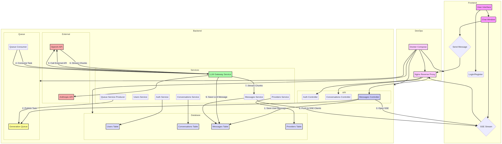

# LingoFlow

Это монолитное приложение, разработанное для демонстрации работы с различными LLM-моделями через унифицированный API. Оно включает в себя клиентскую часть (Nuxt 4), серверную часть (NestJS) и общую инфраструктуру (PostgreSQL, RabbitMQ, Nginx) в рамках одного репозитория.

## 1. Архитектура

Приложение использует **монолитную** архитектуру с четким разделением на client и server. Ключевой особенностью является асинхронная обработка запросов на генерацию LLM-ответов через очередь сообщений (RabbitMQ) и потоковая передача результатов пользователю через Server-Sent Events (SSE).

### 1.1. Схема взаимодействия



**Ключевой поток "Запрос → Очередь → Генерация → Стриминг":**

1.  **client** отправляет сообщение на **server (Messages Controller)** и открывает **SSE-соединение**.
2.  **server** сохраняет сообщение пользователя и публикует задачу в **RabbitMQ**.
3.  **Queue Consumer** получает задачу и передает ее **LLM Gateway Service**.
4.  **LLM Gateway** вызывает внешний LLM API, получает потоковый ответ (chunks).
5.  Каждый chunk отправляется обратно в **Messages Service**, который использует **SSE-контроллер** для передачи данных в реальном времени на **client**.
6.  После завершения стриминга, **LLM Gateway** сохраняет полный ответ в БД.

### 1.2. Стек технологий

| Компонент       | Стек                                              | Назначение                                                  |
| :-------------- | :------------------------------------------------ | :---------------------------------------------------------- |
| **server**      | NestJS, TypeScript, TypeORM, PostgreSQL, RabbitMQ | Бизнес-логика, API, управление данными, LLM-интеграция.     |
| **client**      | Nuxt 4, TypeScript, Nuxt UI, TailwindCSS, Vitest  | Пользовательский интерфейс, адаптивная верстка, SSE-клиент. |
| **База данных** | PostgreSQL                                        | Хранение пользователей, диалогов, сообщений, провайдеров.   |
| **Очередь**     | RabbitMQ                                          | Асинхронная обработка тяжелых задач (LLM-генерация).        |
| **Прокси**      | Nginx                                             | Обратный прокси, балансировка, обработка SSE-соединений.    |

## 2. Структура директорий

```
/llm-chat-monorepo
├── /server                 # NestJS Server
│   ├── /src                 # Исходный код NestJS
│   ├── Dockerfile           # Dockerfile для server
│   └── package.json
├── /client                # Nuxt 4 Client
│   ├── /composables         # Композаблы (например, useSseStream)
│   ├── /tests               # Примеры тестов Vitest
│   ├── Dockerfile           # Dockerfile для client
│   └── nuxt.config.ts
├── /shared                  # Общие TypeScript-типы (DTO, Entities)
├── architecture_diagram.mmd # Схема архитектуры (Mermaid)
├── architecture_diagram.png # Схема архитектуры (PNG)
├── docker-compose.yml       # Конфигурация Docker Compose
├── nginx.conf               # Конфигурация Nginx
└── README.md                # Инструкции (этот файл)
```

## 3. Схемы базы данных (TypeORM Entities)

Схемы `User`, `Conversation`, `Message` и `Provider` определены в файле `server/src/database/entities.ts`.

| Сущность         | Поля                                                            | Описание                                                                                                                           |
| :--------------- | :-------------------------------------------------------------- | :--------------------------------------------------------------------------------------------------------------------------------- |
| **User**         | `id`, `email`, `passwordHash`, `isVerified`, `googleId`, `role` | Учетная запись пользователя. Поддержка email/пароль и Google OAuth.                                                                |
| **Provider**     | `id`, `name`, `baseUrl`, `models`, `isDefault`                  | Конфигурация внешнего LLM-провайдера (например, URL для OpenAI-совместимого API).                                                  |
| **Conversation** | `id`, `title`, `status`, `userId`, `providerId`, `modelName`    | Диалог (чат) между пользователем и LLM. Связан с пользователем и выбранным провайдером/моделью.                                    |
| **Message**      | `id`, `role`, `content`, `conversationId`, `isStreaming`        | Сообщение в диалоге. `role` может быть 'user' или 'assistant'. Флаг `isStreaming` используется для контроля параллельных запросов. |

## 4. DevOps и запуск

### 4.1. Файл `.env`

Перед запуском необходимо создать файл `.env` в корне проекта со следующими переменными:

```env
# Database
POSTGRES_USER=llm_user
POSTGRES_PASSWORD=llm_password
POSTGRES_DB=llm_chat_db

# Auth
JWT_SECRET=your_super_secret_jwt_key
GOOGLE_CLIENT_ID=your_google_client_id
GOOGLE_CLIENT_SECRET=your_google_client_secret

# LLM (пример)
OPENAI_API_KEY=sk-xxxxxxxxxxxxxxxxxxxxxxxxxxxxxxxx
```

### 4.2. Docker Compose

Файл `docker-compose.yml` определяет пять сервисов: `nginx`, `client`, `server`, `postgres`, `rabbitmq`.

**Тома, Сети и Healthchecks:**

- **Сеть:** Используется общая сеть `llm_chat_network` для внутренней коммуникации.
- **Тома:** `postgres_data` используется для персистентного хранения данных PostgreSQL.
- **Healthchecks:** Для каждого сервиса (кроме Nginx) настроены проверки работоспособности (`healthcheck`) для обеспечения корректного порядка запуска и мониторинга.

### 4.3. Инструкции по запуску

1.  **Создайте файл `.env`** (см. выше).
2.  **Запустите все сервисы** с помощью Docker Compose:

    ```bash
    docker-compose up --build -d
    ```

3.  Приложение будет доступно по адресу `http://localhost` (через Nginx). API будет доступен по `http://localhost/api`.
